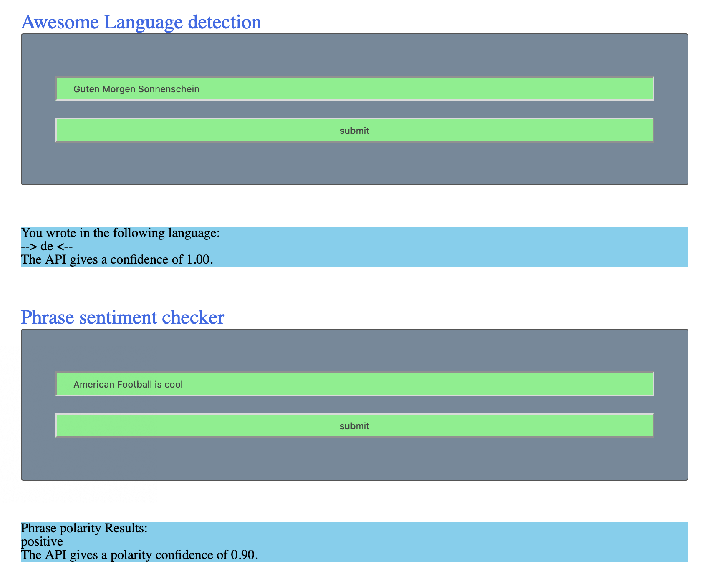

# Project Outline

This repo is your based on starter code for the project.

In this project I got practice using the following
- Setting up Webpack
- Sass styles
- Webpack Loaders and Plugins
- Creating layouts and page design
- Service workers
- Using APIs and creating requests to external urls
- Unit tests with Jest

## Features

This project uses the Aylien api to analyse inputs. For each input, a different NLP analysis is carried out.

Input 1 uses the Aylien API to detect the language of the input

Input 2 uses the Aylien API to detect the sentiment of a phrase.

Both inputs have to be of a certain length, >3 and >8 respectively.

### Aylien API
You can sign up for the API [here](https://developer.aylien.com/signup)
